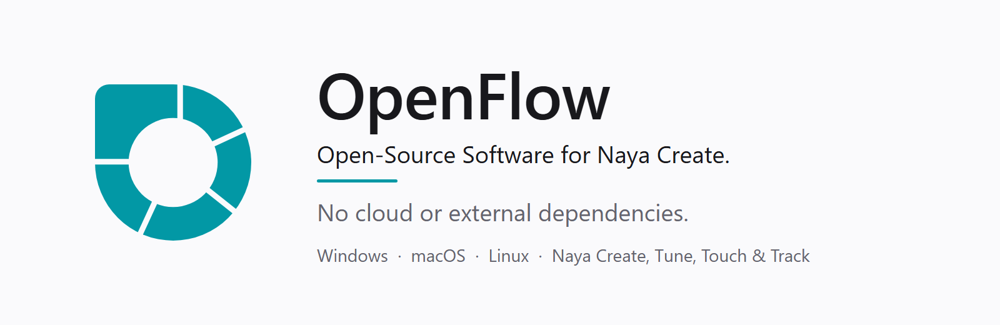
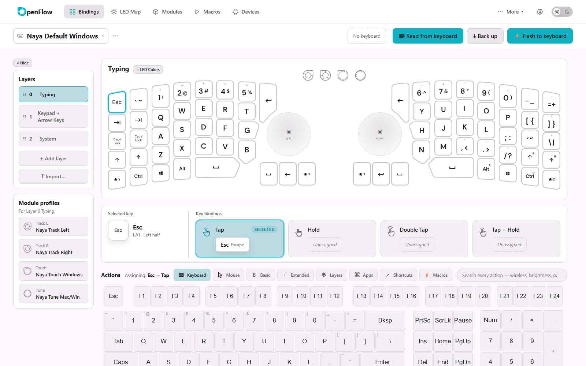
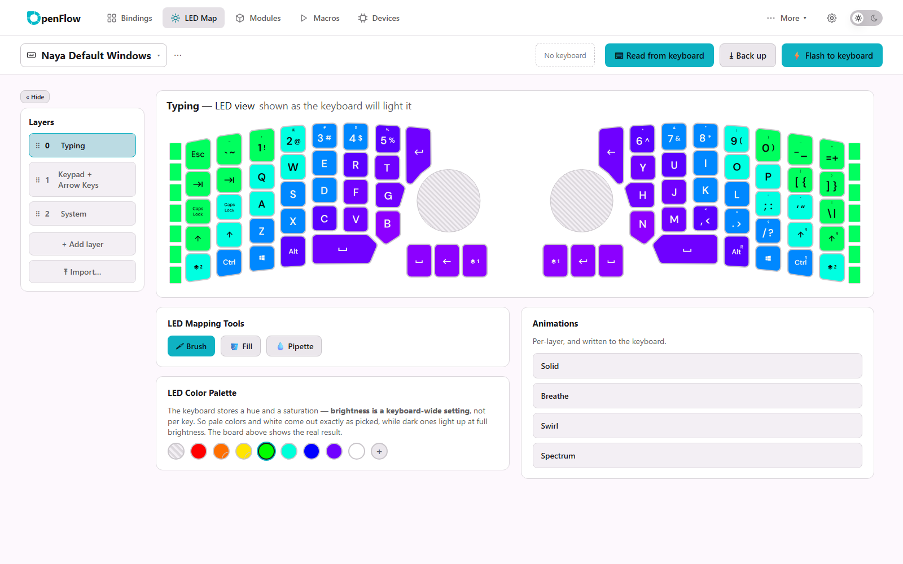
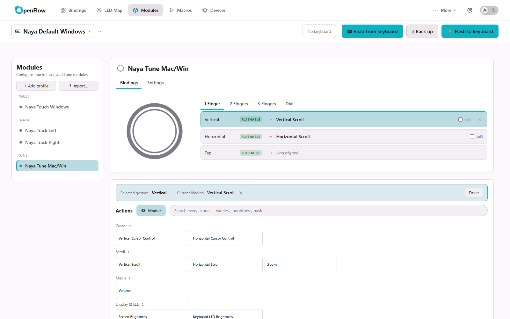

<p align="center">
  <picture>
    <source media="(prefers-color-scheme: dark)" srcset="docs/media/banner-dark.png">
    
  </picture>
</p>

<p align="center">
  <b>Open-source software for the Naya Create keyboard.</b> No account, no cloud, no external dependencies.<br>
  Bindings, layers, lighting and modules, read from the keyboard and flashed back to it, all on your computer.
</p>

<p align="center">
  <a href="https://github.com/create-collective/openflow/releases/latest"></a>
  <a href="https://github.com/create-collective/openflow/releases"></a>
  
  <a href="LICENSE"></a>
</p>

<p align="center">
  <a href="https://github.com/create-collective/openflow/releases/latest"></a>&nbsp;
  <a href="https://github.com/create-collective/openflow/releases/latest"></a>&nbsp;
  <a href="https://github.com/create-collective/openflow/releases/latest"></a>
</p>

<p align="center"><a href="#install">Install</a> · <a href="https://github.com/create-collective/openflow/releases">Release notes</a> · <a href="https://create-collective.github.io/Create-knowledge-base/">Knowledge base</a> · <a href="https://github.com/create-collective/openflow/issues/new">Report a bug</a></p>

<p align="center">
  <picture>
    <source media="(prefers-color-scheme: dark)" srcset="docs/media/bindings-dark.png">
    
  </picture>
</p>

Naya has shut down, so its own app, NayaFlow, is no longer maintained, and the keyboards outlive
it. OpenFlow is an independent rebuild that keeps the Create configurable. It talks to the
keyboard directly over USB and needs nothing else.

## Highlights

| Feature | What it means for you |
|---|---|
| **Read, back up, flash** | Read what the keyboard holds, keep backups (automatic and by hand), and flash your changes back. Nothing is written until you press Flash, and the preview lists anything the keyboard cannot store. |
| **OneKey: four behaviours per key** | Tap, Hold, Double Tap and Tap + Hold on the same key, with the timing the keyboard uses. |
| **Layers** | Add layers and move between them with keys that hold, toggle, force or stick a layer. |
| **LED Map** | Colour every key per layer with a brush, fill and pipette, see the board as the keyboard will light it, and pick a Solid, Breathe, Swirl or Spectrum animation. |
| **Modules** | Touch, Tune and Track profiles: taps, swipes, the dial and scrolling by finger count, with a module profile per layer. |
| **Actions by name** | Keys, mouse, media, Bluetooth, lighting and layer actions, plus shortcuts for 150 apps, searchable in one palette. |
| **Devices** | What each half runs and how charged it is, Bluetooth slots, a split-link check for a half that will not connect, and a read-only check of a half sitting in its bootloader. |
| **Signed, and it updates itself** | The Windows installer is signed and the macOS app is notarized. OpenFlow asks once whether to look for updates weekly, and installs one only when you click Install, never during a flash. |

<table>
  <tr>
    <td width="50%">
      <picture>
        <source media="(prefers-color-scheme: dark)" srcset="docs/media/led-map-dark.png">
        
      </picture>
    </td>
    <td width="50%">
      <picture>
        <source media="(prefers-color-scheme: dark)" srcset="docs/media/modules-dark.png">
        
      </picture>
    </td>
  </tr>
  <tr>
    <td align="center"><i>LED Map</i></td>
    <td align="center"><i>Modules</i></td>
  </tr>
</table>

## Held back in this release

OpenFlow can already do more than this release switches on. These parts stay off until each has
been proven on more keyboards, and the app says so where they appear:

- **Firmware updates for the keyboard and for modules.** You can see what each half and module
  runs, browse the firmware library and plan an update; writing firmware is held back.
- **Recovery procedures and the split-link repair's repair step.** Every read-only check works:
  the split-link check, the repair's plan, and the bootloader check.
- **Macros are app-only.** You can record and keep them, but the keyboard's firmware has no
  macro table, so they cannot run on the keyboard yet.

## Install

Download the file for your system from the
[latest release](https://github.com/create-collective/openflow/releases/latest).

- **Windows 10 or 11:** `OpenFlow-<version>-win-x64-setup.exe` installs for your user, no
  administrator needed. `OpenFlow-<version>-win-x64-portable.exe` runs without installing (it
  cannot update itself). Windows shows the publisher as Travis Wye; SmartScreen may still ask
  for a few days after a new release while Microsoft's download reputation builds up.
- **macOS:** `OpenFlow-<version>-mac-arm64.dmg` for Apple Silicon, `-mac-x64.dmg` for Intel.
  Open it and drag OpenFlow into Applications. The app is notarized, so it opens on a
  double-click.
- **Linux:** the `.deb` for Debian, Ubuntu and their relatives, the AppImage for everything else.
  See [Installing on Linux](#installing-on-linux): the keyboard needs a udev rule.

Plug in both halves over USB and press **Read from keyboard**. The keyboard does not have to be
attached to explore or edit; nothing is written to it until you flash.

**Updates.** The first time the Hub opens, OpenFlow asks whether to check for updates once a week.
A check downloads one small file from GitHub naming the newest release; nothing about you or your
keyboard is sent. An update installs only when you click Install, in the Hub or Settings › About,
and never while a flash is running. The portable build and a `.deb` install show a download link
instead.

**Report a bug** from inside the app (More › Report a bug), which attaches what it needs, or open
an [issue](https://github.com/create-collective/openflow/issues/new).

## Installing on Linux

Each half of the keyboard is a USB serial port (`/dev/ttyACM*`) that belongs to root and the
`dialout` group, so a normal user cannot open it until OpenFlow's udev rule
(`build/linux/70-openflow.rules`) is installed. The rule also keeps ModemManager from probing the
keyboard, which otherwise collides with its protocol for several seconds after every plug-in.

- **Debian, Ubuntu, Mint, Pop!_OS: use the .deb.** It installs the rule and reloads udev:
  `sudo apt install ./OpenFlow-<version>-linux-amd64.deb`, then start OpenFlow from the menu.
- **Anything else: use the AppImage** (`OpenFlow-<version>-linux-x86_64.AppImage`). `chmod +x`
  it and run it. The first time, the Hub shows
  a warning with the three commands that install the rule, and a button to copy them. Run them
  once; the keyboard appears on the next poll (unplug and replug it if not). The same commands:

```bash
printf '%s\n' 'ACTION!="remove", SUBSYSTEMS=="usb", ATTRS{idVendor}=="37d1", ENV{ID_MM_DEVICE_IGNORE}="1"' 'ACTION!="remove", SUBSYSTEM=="tty", ATTRS{idVendor}=="37d1", TAG+="uaccess"' | sudo tee /etc/udev/rules.d/70-openflow.rules >/dev/null
sudo udevadm control --reload-rules
sudo udevadm trigger --subsystem-match=tty
```

The rule grants access to whoever is logged in at the machine's own screen (systemd-logind's
`uaccess`). Over SSH or on a system without logind, add yourself to the group instead and log
in again: `sudo usermod -aG dialout $USER` (`uucp` on Arch).

An AppImage that will not start usually means one of two things. On Ubuntu 22.04 and later
without `libfuse2`, run it with `--appimage-extract-and-run` or install `libfuse2t64`
(`libfuse2` on 22.04). On Ubuntu 24.04 and later, AppArmor blocks Electron's sandbox for an
AppImage; the .deb installs the AppArmor profile that allows it, so prefer the .deb there.

## Where your data lives

The database is **not** in the repository. It goes to `%APPDATA%/OpenFlow` on Windows,
`~/Library/Application Support/OpenFlow` on macOS, `$XDG_DATA_HOME/OpenFlow` on Linux, or
wherever `OPENFLOW_DATA_DIR` points if you set it. So you can throw it away and re-seed freely:

```bash
OPENFLOW_DATA_DIR=/tmp/openflow-scratch python -m openflow_backend 3001   # seeds itself on first run
```

Next to `user-data.db` you will find `backups/` (the automatic and manual backups),
`logs/backend.log` (the backend's own log, rotated) and, when run as the desktop app,
`logs/sidecar.log` (what the shell captured from the backend process) and `shell/` (Chromium's
cache and preferences, kept apart from your data on purpose). Uninstalling leaves all of it in
place.

## Building from source

OpenFlow is an Electron shell around a Python backend (FastAPI) and a React renderer.

### Layout

```
backend/     Python (FastAPI). Device protocol, flash planning, the action catalogue.
frontend/    React + Vite. The renderer -- this is the part to look at for styling.
electron/    Desktop shell. Spawns the backend, hosts the renderer.
docs/        Reference data the backend loads at runtime, plus notes.
device/      A few captured device reads, used as test fixtures.
```

No TypeScript; the renderer is plain JSX.

### Running it

```bash
# backend  (needs Python 3.12+)
cd backend
python -m venv .venv && .venv/Scripts/activate      # or source .venv/bin/activate
pip install -e ".[dev]"

python -m openflow_backend 3001                      # the port is POSITIONAL, not --port
# A first run seeds itself from the captured stock profile that ships in device/, so the app
# never opens empty. To start over, delete the database (see below) or re-seed by hand:
#   python -m openflow_backend.seed --force

# frontend
cd frontend
npm install
npm run dev                                          # http://localhost:5173
```

`npm run build` runs `tools/check-undefined.mjs` first — it catches undefined hooks, components
and state setters, which render as a blank page rather than a build error.

The backend test suite runs without a keyboard attached:

```bash
cd backend && python -m pytest -q          # runs against a temporary data dir
```

The frontend has its own gates: `npm run verify` (undefined-reference check, the style budget in
`tools/style-budget.json`, the vitest unit tests including the api-contract test against
`backend/tests/route-manifest.json`, then the build) and `npm run e2e` (a Playwright walk of every
page in both themes against a backend of its own on port 3011, seeded from the snapshot; it
leaves a screenshot per page under `tests/e2e/shots/`).

Nothing here talks to the keyboard unless you explicitly flash; the app is read-only until then,
and it runs perfectly well with no keyboard attached -- which is the expected setup for design
work.

### Building the desktop app

The app is the Electron shell in `electron/` around the backend frozen with PyInstaller
(`backend/openflow_backend.spec`) and the built renderer, which the frozen backend serves itself
at `http://127.0.0.1:<port>/` so page and API share one origin. The root `package.json` drives it:

```bash
# once: Node 22+, the backend venv with the build extra, the shell's dependencies
cd backend && pip install -e ".[dev,build]" && cd ..
npm install

npm run build:win            # frontend -> sidecar -> sidecar smoke test -> NSIS installer + portable exe
npm run build:mac            # dmg (unsigned on a developer machine: right-click > Open the first time)
npm run build:linux          # AppImage + deb (see "Installing on Linux" below)
```

Artefacts land in `release/` as `OpenFlow-<version>-win-x64-setup.exe`,
`OpenFlow-<version>-win-x64-portable.exe`, and so on. `npm run smoke:sidecar` starts the frozen
backend on a free port with a scratch data dir and checks every bundled resource; it runs inside
`build:app` so a broken bundle never reaches an installer. `npm run start:dev` runs the shell
against the Vite dev server and the venv backend (OPENFLOW_DEV=1).

The one version number is `__version__` in `backend/openflow_backend/__init__.py`; `npm run
version:sync` stamps it into the two `package.json` files and `version:check` (part of
`build:app` and CI) refuses to build when they drift.

Local builds are unsigned; release builds are signed. `scripts/ci-signing.mjs` runs before
electron-builder and, with the Apple secrets present (a Developer ID certificate and an App
Store Connect key), turns on signing and notarization for the two Mac rows; with the Azure
Artifact Signing secrets present it signs the Windows executables, the installer and the
portable build. Both sets are in place: Windows releases are signed since 0.6.0, and macOS
releases are signed and notarized from the first release after 0.6.0, so the dmg's app opens
on a double-click. Without the secrets (a fork, say) the build is unsigned, as before, and
Windows shows its "unknown publisher" prompt on first launch. A partial set of secrets fails
the job rather than shipping something that only looks signed. The script's header lists
every secret and variable by name; they are repository secrets here and in Create Companion,
whose release reads the same names.

The release workflow builds Linux on the oldest Ubuntu runner on purpose: the frozen backend
needs a glibc at least as new as the build machine's, so the CI build runs on Ubuntu 22.04,
Debian 12, Fedora 36 and anything newer. A build from a newer machine only runs on that
machine's generation and newer; do not hand one to a tester.

### Where the styling lives

- `frontend/src/styles/` — `app.css` (shell, buttons, tokens) and `editor.css` (the keyboard
  board, palette, LED views)
- `frontend/src/components/KeymapBoard.jsx` — the virtual keyboard, drawn as SVG key shapes
- `frontend/src/pages/` — Bindings, Color, Modules, Macros, Troubleshooting

Colours come from CSS custom properties (`--neutral*`, `--accent`, `--text`, `--border-strong`),
so a theme is mostly a matter of redefining those.

## Third-party data

`docs/reference/app-shortcuts.json` is derived from ShortcutMapper (MIT) — see
`docs/reference/ATTRIBUTION.md`, which must travel with it.

`backend/openflow_backend/_vendor/nayactl` is a vendored copy of nayactl.

## License

Apache-2.0; see [LICENSE](LICENSE).
